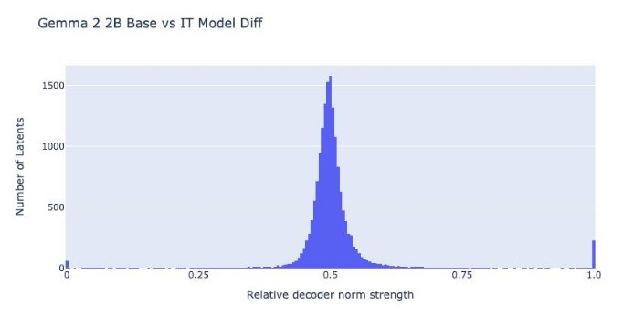
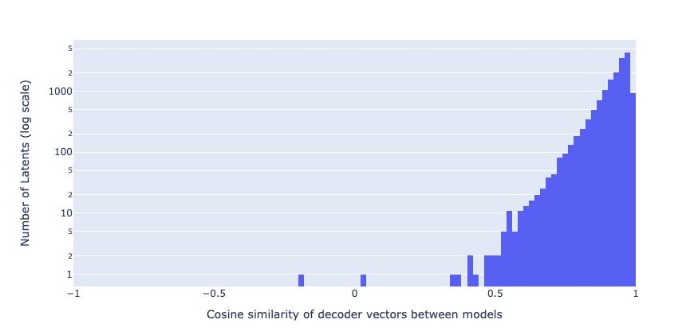
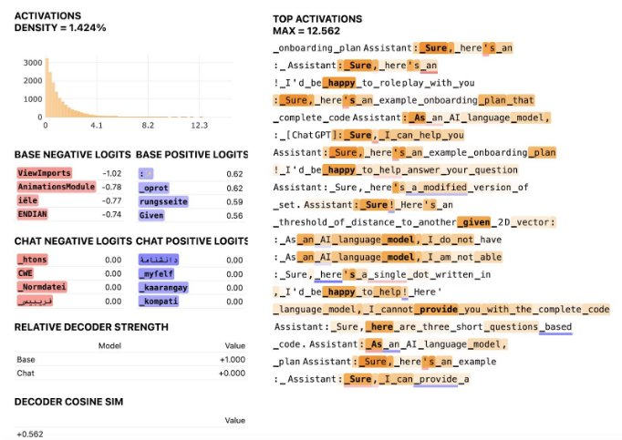
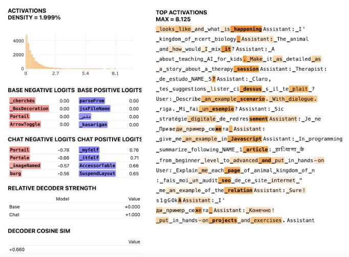
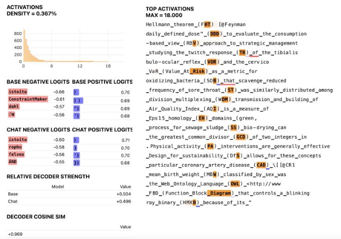

Interpretability (ML & AI) Language Models Transformer Circuits AI Frontpage 39 

CHAPTERS SUBSCRIBE 10 10

00:00 /  12:44 1X

[Open Source Replication of Anthropic’s Crosscoder paper for model-diffing](https://www.lesswrong.com/posts/srt6JXsRMtmqAJavD/open-source-replication-of-anthropic-s-crosscoder-paper-for)

by Connor Kissane, robertzk, Arthur Conmy, Neel Nanda 28th Oct 2024

AI Alignment Forum

Intro

Anthropic recently released an exciting mini-paper on crosscoders ([Lindsey et al.](https://transformer-circuits.pub/2024/crosscoders/index.html)). In this post, we open source a [model-diffing crosscoder](https://huggingface.co/ckkissane/crosscoder-gemma-2-2b-model-diff) trained on the middle layer residual stream of the Gemma-2 2B base and IT models, along with [code](https://github.com/ckkissane/crosscoder-model-diff-replication), implementation details / tips, and a [replication](#_page1_x22.50_y370.50) of the core results in Anthropic’s paper.

While Anthropic highlights several potential applications of crosscoders, in this post we focus solely on “model-diffing”. That is, localizing and interpreting a small “diff” between two different models. We think this is a particularly exciting application, because it can let us examine what changed as a model was fine-tuned, which seems likely to capture most safety-relevant circuitry, while leaving out many less relevant capabilities.

In their paper, they find exciting preliminary evidence that crosscoders identify shared sets of features across different models, as well as features specific to each model. While it’s still an open question how useful crosscoders will be for model-diffing, they show significant signs of life, and we’re excited to see the community build on this open source replication to explore them further. 

TLDR;

- We train and open source a 16K latent crosscoder to model diff the Gemma 2 2B Base and IT models at the middle layer residual stream. Download the weights at <https://huggingface.co/ckkissane/crosscoder-gemma-2-2b-model-diff>
  - See this [colab demo](https://colab.research.google.com/drive/124ODki4dUjfi21nuZPHRySALx9I74YHj?usp=sharing) to load and use the autoencoder
  - We also open source a scrappy training codebase at [https://github.com/ckkissane/crosscoder-model-diff-replication a](https://github.com/ckkissane/crosscoder-model-diff-replication)long with some implementation details + tips for training your own
- Anthropic’s core results replicate: the pair of decoder vector norms for each latent cluster into three main groups: “shared” (norms are similar), “base model specific” (only base model norm is large), and “chat model specific” latents (only chat model norm is large). The “shared” latents have highly aligned decoder vectors between models.
- We do some standard SAE-style evals. On average, the crosscoder has 81 L0, 77% explained variance, and 95% loss recovered relative to zero ablation on the training distribution.
- We perform some shallow explorations into latents from each of the “shared”, “base model specific”, and “chat model specific” latents. We use latent dashboard visualizations of the maximum activating examples (introduced by[ Bricken et al.](https://transformer-circuits.pub/2023/monosemantic-features/vis/a1.html)) and provide code to generate crosscoder latent dashboards yourself in the [colab demo](https://colab.research.google.com/drive/124ODki4dUjfi21nuZPHRySALx9I74YHj?usp=sharing).

Replicating key results

We trained a crosscoder of width 16,384 on the residual stream activations from the middle layer of the Gemma-2 2B base and IT models. The training dataset consisted of 400M tokens: 50% the [pile uncopyrighted](https://huggingface.co/datasets/monology/pile-uncopyrighted), and 50%[ LmSys-chat-1m](https://huggingface.co/datasets/lmsys/lmsys-chat-1m). See the implementation details section for further details on training.

Replicating the main result from the model-diffing section of Anthropic’s paper, we find that latents mostly cluster into 3 distinct groups: 

- “**shared**” latents that have similar decoder vector norms for both models,
- “**base model specific**” latents with high norm in base decoder relative to chat decoder
- “**chat model specific**” latents with high norm in chat decoder relative to base decoder

We do however notice some asymmetry, as there seem to be more “chat model specific” latents (~225) compared to “base models specific” latents (~60). We’re not sure why: it could be a fact unique to Gemma-2 2B, or some artifact of our training setup. For example, we’re not sure what training data Anthropic used and whether they employ additional training adjustments.

We also check the cosine similarity of decoder vectors for only the “shared latents” between the two models (latents with relative norm between 0.3 and 0.7). Like Anthropic, we find that the vast majority of “shared latents” have highly aligned decoder vectors. This suggests that these latents “do in fact represent the same concept, and perform the same function, in the two models” ([Lindsey et al.](https://transformer-circuits.pub/2024/crosscoders/index.html)).  We also find some notable exceptions with very low or negative cosine similarity, further corroborating Anthropic’s findings. 

Evaluating sparsity and reconstruction fidelity

Here we apply some evaluations typically used to evaluate Sparse Autoencoders in order to measure sparsity and reconstruction fidelity of this crosscoder. We use the following standard metrics:

- L0, the average number of latents firing per input activation, to evaluate sparsity
- Explained variance, essentially the MSE relative to predicting the mean activation of the batch, to measure reconstruction quality.
- CE recovered, as an additional measure of reconstruction fidelity. Here we show both the raw CE delta (loss with SAE spliced - clean loss), as well as the % of cross entropy loss recovered relative to a zero ablation baseline.

See e.g. [the Gated SAEs paper ](https://arxiv.org/abs/2404.16014)for a discussion of full definitions.

The L0 and Explained variance metrics are both computed on one batch of 4096 randomly shuffled activations from the crosscoder training distribution. The CE loss metrics are computed on 40 random sequences of length 1024 from the crosscoder training distribution.

Models: Gemma-2-2b, Gemma-2-2b-it

|Eval Dataset|L0|Base CE Loss rec %|Chat CE Loss rec %|Base CE Delta|Chat CE Delta|Base Explained Variance %|Chat Explained Variance %|
| :- | - | - | - | :- | :- | :- | :- |
|Pile + Lmsys mix|81|95\.43%|95\.67%|0\.488|0\.453|77\.90%|77\.56%|

Without other public crosscoders as reference points, we're still developing intuitions for what constitutes strong performance in this domain. Drawing from our experience with SAEs, we believe this crosscoder has reached a level of performance that makes it a viable tool for interpretability research, though there remains substantial room for improvement. 

Implementation details and tips

The crosscoder was trained using the SAE training recipe from [Anthropic’s April update](https://transformer-circuits.pub/2024/april-update/index.html#training-saes). We train the crosscoder on 400M activations. The activations are extracted from sequences of 1024 tokens, stored in an in-memory activation buffer, and randomly shuffled. When extracting activations, we ignore the first BOS token, as these typically have [outlier norms ](https://www.lesswrong.com/posts/fmwk6qxrpW8d4jvbd/saes-usually-transfer-between-base-and-chat-models#Identifying_failures__Outlier_norm_activations_and_Gemma_v1_2B). We fear that including BOS activations may destabilize training or waste crosscoder capacity. 

The training dataset is a mixture of 50%[ pile uncopyrighted](https://huggingface.co/datasets/monology/pile-uncopyrighted), and 50%[ LmSys-Chat-1M](https://huggingface.co/datasets/lmsys/lmsys-chat-1m). We prepend BOS to each sequence. We apply no special formatting to the pile sequences. In contrast, we format LmSys data with the following chat template:

"""User: {instruction} Assistant: {completion} """

Note that we don’t use the official Gemma 2 chat template, as we find that it often breaks the base model. We’re not sure if this is principled, as we suspect some chat specific features may more frequently fire on the special control tokens ([Arditi et al.](https://arxiv.org/abs/2406.11717)). It would be possible to exclusively use the chat template for the IT model, but this would mean different prefix tokens would be used for base and IT models, so we avoided this.

We used the following key hyperparameters for this training run:

- Batch size: 4096
- LR: 5e-5
- L1 Coefficient: 2
- Width: 16384
- Activation site: resid\_pre layer 14

These were selected as defaults based on intuitions from our experience training SAEs, and we didn't systematically tune them. For cross-layer (not model-diffing) crosscoders, [Neel](https://github.com/neelnanda-io/Crosscoders) found that training was quite sensitive to the W\_dec init norm. We used a W\_dec init norm of 0.08 here, and this might be worth tuning more carefully in future runs.

You can see the training code at [https://github.com/ckkissane/crosscoder-model-diff- replication](https://github.com/ckkissane/crosscoder-model-diff-replication). You can also see this [wandb report ](https://api.wandb.ai/links/ckkissane/5uny2i6y)for training metrics.

Investigating interpretable latents from different clusters

In Anthropic’s paper, they mention some examples of interesting latents from the “chat model specific” and “base model specific” clusters. In this section, we also explore some latents from these clusters. We view latent dashboards (Introduced in [Towards Monosemanticity](https://transformer-circuits.pub/2023/monosemantic-features/vis/a1.html) and open sourced by[ McDougall](https://github.com/callummcdougall/sae_vis), as well as [Lin and Bloom](https://www.neuronpedia.org/)) which were generated from a 1M token sample of the crosscoder pre-training distribution (Pile + LmSys mix).  In the [colab demo](https://colab.research.google.com/drive/124ODki4dUjfi21nuZPHRySALx9I74YHj?usp=sharing), we also show how you can generate these dashboards yourself.

We only looked at a handful of these latents, and cherry picked some of the most interesting latents that we found. We think that looking into specific interesting latents and more rigorous interpretability analyses both seem like promising future directions.

We first inspected some of the “base model specific” latents. These were often hard to understand at a glance, but here we show latent 12698, which we think fires when the assistant starts to give a response to some instruction. 

Latent 12698

Anthropic similarly found a “feature that activates on dialogues between humans and a smartphone assistant”. Perhaps fine-tuning needs to “delete” and replace these outdated representations related to user / assistant interactions.

We also explored some “chat specific latents”. We expected to find some latents that primarily fire on the LmSys data, and indeed we found an interesting latent 2325 that we think fires at the end of an instruction, often just before the assistant starts to give a response.

Latent 2325

Finally, the “shared” crosscoder latents feel very similar to classic SAE latents. These are often easier to interpret, firing on clear tokens / contexts, but also less interesting / abstract. For example, latent 15 seems to fire at the end of acronyms in parentheses, and boosts the logits of the closing parentheses in both models. 

Latent 15

Looking forward, we’re excited to see future work that performs deep dives on the “chat-” and “base-specific” latents. These might be a hook to localize key bits of the model that fine-tuning meaningful changes, and also might be useful to find latents related to especially interesting related chat-model behaviors (e.g modeling of the user) in an unsupervised fashion. 

Author Contributions Statement

Connor trained the crosscoder, ran all of the experiments, and wrote the post. Neel shared cross-layer crosscoder training code which Connor adapted for model-diffing. Arthur and Neel both made helpful suggestions for training and evaluating the crosscoders, such as the data mix and how to format the LmSys data. Arthur, Neel, and Rob all gave helpful feedback and edits on the post. The original idea to open source a crosscoder for model-diffing was suggested by Neel.

Mentioned in

59 [MATS Applications + Research Directions I'm Currently Excited About](https://www.lesswrong.com/posts/qGKq4G3HGRcSBc94C/mats-applications-research-directions-i-m-currently-excited)

4 comments, sorted by top scoring

[- ] J Bostock 3mo 3 0

Perhaps fine-tuning needs to “delete” and replace these outdated representations related to user / assistant interactions.

It could also be that the finetuning causes this feature to be active 100% of the time, and which point it no longer correlates with the corresponding pretrained model feature, and it would just get folded into the decoder bias (to minimize L1 of fired features).

[- ] Wei Shi 3mo Ω 0 1 0

We trained a crosscoder of width 16,384 on the residual stream activations from the middle layer of the Gemma-2 2B base and IT models.

I don't understand the training process here, as well as the mini-paper from Anthropic. How do you train one crosscoder on the residual stream from two different models?

[- ] Neel Nanda 3mo Ω 4 4 0

It's essentially training an SAE on the concatenation of the residual stream from the base model and the chat model. So, for each prompt, you run it through the base model to get a residual stream vector v\_b, through the chat model to get a residual stream vector v\_c, and then concatenate these to get a vector twice as long, and train an SAE on this (with some minor additional details that I'm not getting into)

[- ] Wei Shi 3mo Ω 0 1 0 I got it, thank you very much!

Moderation Log
